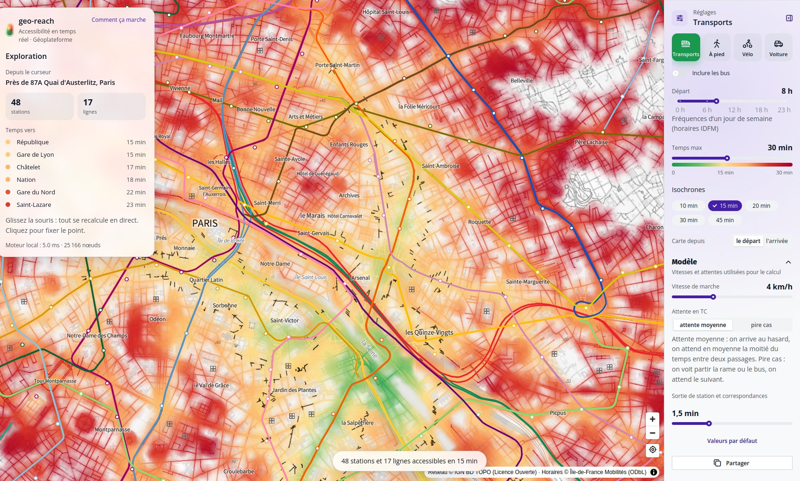

# geo-reach

### How far can you go in 15 minutes, from anywhere in Île-de-France?

Move the mouse: travel times to the whole region are recomputed **at every move**, on foot, by bike, by car or by
public transport, and the map lights up from green (close) to red (far).

**[▶ Open the demo](https://ignf.github.io/geo-reach/)** · [How it works](https://ignf.github.io/geo-reach/how-it-works.html)
· desktop browser recommended

[](https://ignf.github.io/geo-reach/)

| 540,000 | 711,000 | ~2,000 | 0 |
|:---:|:---:|:---:|:---:|
| street crossings | road sections | transit lines | server: everything runs in your browser |

- **Géoplateforme data** (IGN): BD TOPO road network, Plan IGN basemap, geocoding; Île-de-France Mobilités timetables
  for public transport.
- **A Rust engine compiled to WebAssembly**, in a background thread: the whole region in a few tens of milliseconds
  at most, where a routing server would need seconds per map.

## What you can do

- **Hover anywhere**: the map is recolored by travel time from the cursor, at every mouse move.
- **Click to pin a point**: then hover a destination to see the time, the route drawn on the map and the trip
  step by step (streets, waits, metro or bus lines).
- **Choose how you travel**: walk, bike, car or public transport (metro, RER, tram, with or without buses).
- **Choose the time of departure**: car times follow a typical weekday traffic curve, transit times follow the
  real service frequency at that hour.
- **Departure or arrival**: "where can I go from here" or "where can people come from to reach this point".
- **Travel time up to**: one duration for the colors and the figures, with contour lines every 10 or 15 min.
- **Scenarios**: disrupted transit (fewer departures, slower rides) or congested roads, as what-if coefficients.
- **Adjust the calculation**: walking and cycling speed, traffic, average or worst-case wait, transfer time.
- **Read the figures**: stations and lines you can board, nearest station, cycle lanes, travel times to well-known
  places (Châtelet, Gare de Lyon, La Défense…).
- **Share**: the link keeps the whole view (mode, hour, point, settings).

The interface is in French or English, following the browser language.

## How accurate is it?

It is a proof of concept, good for comparing places and modes, not for planning a trip to the minute:

- **Transit**: average waits (half the time between two trains or buses at that hour) on a typical weekday, not the
  exact timetable; changes happen inside the station.
- **Car**: estimated traffic from a typical congestion curve, no live traffic, no traffic lights.
- **Walk**: 4 km/h, as the Géoplateforme route service. **Bike**: 15 km/h, a little faster on cycle lanes.
- **Zone**: Île-de-France. Full street network in Paris and the inner suburbs; beyond, no footpaths, tracks nor
  service roads (main roads, streets and station access are kept).

The first visit downloads the network (about 13 MB compressed); the browser then keeps it, so later visits load
locally.

When the cursor stops, walking and driving times are checked against the Géoplateforme route service, shown in the
trip panel.

## Why not call the Géoplateforme route service directly?

The first version did: on each click, it asked the Géoplateforme for a series of isochrones (12 to 15) and merged
them into a map. One map took 1.2 s on foot and 2.7 s by car, and the service accepts about 5 requests per second.
Following the mouse needs a new map at every screen refresh, 30 to 60 per second: about a hundred times more. The
route service is made to answer route requests, not to feed an interactive map, and it has no public transport.

So the **data** comes from the Géoplateforme and the **computation** runs in the browser:

- the road network is the BD TOPO, read from the Géoplateforme WFS; the basemap is Plan IGN; addresses come from
  its reverse geocoding;
- the route service stays the reference: when the cursor stops, its walking or driving time is shown beside ours
  in the trip panel. Walking uses the same speed (4 km/h); night driving times differ by about 15 %
  (`scripts/calibrate.ts --gpf`).

What would let the Géoplateforme serve this directly: a one-to-many service (a matrix of travel times, or
isochrones as a grid), or a downloadable routing graph.

## Legal notice

Published by the Institut national de l'information géographique et forestière (IGN), 73 avenue de Paris, 94160
Saint-Mandé, France; hosted by GitHub Pages. A proof of concept, not an official IGN service. No account, no cookie,
no audience measurement; the coordinates of the points looked at go to the Géoplateforme for addresses and route
comparison. Full text: [legal notice](https://ignf.github.io/geo-reach/legal.html).

## Data and licences

| Data | Source | Licence |
|---|---|---|
| Road network (BD TOPO) and basemap (Plan IGN) | IGN, Géoplateforme | Licence Ouverte Etalab 2.0 |
| Addresses near a point | Géoplateforme reverse geocoding | Licence Ouverte Etalab 2.0 |
| Public transport timetables | [Île-de-France Mobilités GTFS](https://transport.data.gouv.fr/datasets/reseaux-urbains-et-interurbains-dile-de-france-mobilites-idfm) | ODbL |

`transit.bin` is a database derived from the IDFM timetables, under the same ODbL licence.

## For developers

### Run it locally

Requirements: [Bun](https://bun.sh). Rust is only needed to change the engine (see below).

```sh
bun install
bun run dev        # http://127.0.0.1:5173
bun run build      # static site in web/dist
```

The prepared data (`web/public/data/*.bin`) and the compiled engine (`web/src/engine/engine.wasm`) are in
the repository: no data download, no Rust needed to run the app.

### How it works, in short

1. **Once, offline**: the BD TOPO roads (Géoplateforme WFS) and the IDFM timetables are packed into two compact
   binary files.
2. **At every mouse move**: the cursor is attached to the nearest street, then a shortest path engine written in
   Rust and compiled to WebAssembly computes the time to the whole network, in a background thread (Web Worker) so
   that the map never freezes.
3. **Drawing**: a WebGL layer on top of the MapLibre map colors every street on the graphics card; only the new
   times are sent at each move. The isochrone lines are traced on a 150 m grid from the reached streets and transit
   lines.

The same explanation, with an interactive diagram: [How it works](https://ignf.github.io/geo-reach/how-it-works.html).

Details: [architecture](docs/architecture.md), [engine](docs/engine.md), [rendering](docs/rendering.md),
[data formats](docs/data-formats.md).

### Layout

```
web/                 React + MapLibre app (Vite), UI built with @ign-junn/design-system
crates/engine/       travel time engine in Rust, compiled to WebAssembly
crates/gtfs-prep/    Rust tool: GTFS timetables → public transport layer (transit.bin)
scripts/             road network preparation (graph.bin), engine build
docs/                technical documentation
```

A *crate* is a Rust package (the equivalent of an npm package).

### Change the engine

Install Rust and the WebAssembly target:

```sh
rustup target add wasm32-unknown-unknown
bun run engine     # also run by `bun run dev` and `bun run build` when cargo is found
```

### Rebuild the data

```sh
bun run data                                        # BD TOPO road network → web/public/data/graph.bin
mkdir -p .cache/gtfs
curl -L -o .cache/gtfs/idfm.zip https://www.data.gouv.fr/api/1/datasets/r/413988ed-d340-467b-8be2-7b999fcd207a
cargo run -p gtfs-prep --release -- .cache/gtfs/idfm.zip web/public/data/graph.bin web/public/data/transit.bin
```

The zone is set in `scripts/buildGraph.ts` (`BBOX`), the reference day in `crates/gtfs-prep`.

### Deployment

Every push to `main` builds the app and publishes it on GitHub Pages (`.github/workflows/pages.yml`).
