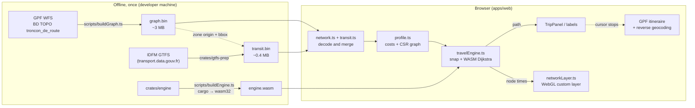
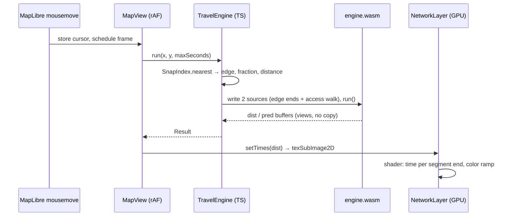

# Architecture

geo-reach is a static web app: no backend, no server-side computation. Everything that reacts to the mouse runs in
the browser, from data prepared once at build time. The only network calls after the first load are the basemap
tiles and two optional Géoplateforme queries made when the cursor stops (route comparison, reverse geocoding).

## The big picture

## Layout

| Path | Language | Role |
|---|---|---|
| `scripts/buildGraph.ts` | TypeScript (Bun) | Downloads the BD TOPO road sections of the zone from the GPF WFS and writes `graph.bin` |
| `crates/gtfs-prep` | Rust (native) | Reads the IDFM GTFS zip and writes `transit.bin`, aligned on the origin of `graph.bin` |
| `crates/engine` | Rust → WebAssembly | Bounded multi-source Dijkstra, ~180 lines, no dependencies |
| `scripts/buildEngine.ts` | TypeScript (Bun) | `cargo build --target wasm32-unknown-unknown`, copies the result to `apps/web/src/engine/engine.wasm` |
| `apps/web/src/engine/` | TypeScript | Loads the binaries, builds the per-mode graph, drives the WASM engine, rebuilds paths |
| `apps/web/src/map/networkLayer.ts` | TypeScript + GLSL | MapLibre custom layer that draws the network colored by time |
| `apps/web/src/components/` | React | Map, control bar, trip panel |
| `apps/web/src/lib/` | TypeScript | Config, GPF clients, URL state, colors, formatting |
| `apps/web/src/locales/` | TypeScript | UI strings (English, French), picked from the browser language |

Two workspaces sit side by side: Bun for JavaScript (`package.json`, `apps/*`) and Cargo for Rust (`Cargo.toml`,
`crates/*`). A *crate* is a Rust package.

## Why it is fast

The design goal is "no network call on mouse move". Each piece removes one cost from the hot path:

| Cost | Removed by |
|---|---|
| Routing server round trip (300–500 ms per GPF isochrone) | Local graph + WASM Dijkstra (~1–6 ms) |
| JSON parsing of the network | Binary files read as typed array views (zero copy) |
| Allocation per run | Buffers allocated once in WASM memory, reset lazily (only the nodes touched last time) |
| Copying results out of WASM | JS reads `dist` / `pred_*` as views on the WASM memory |
| Re-uploading geometry to the GPU | Geometry uploaded once per profile; each move uploads only the node times (one float per node) |
| Running more than once per frame | Mouse events only store the cursor; `requestAnimationFrame` runs the engine once for the latest position |
| React re-renders at 60 Hz | Map label and route are updated imperatively; React panels are throttled |

## Hot path: one mouse move

When a point is pinned (click), the engine runs once from that point and the result is copied (`TravelEngine.pin`).
Mouse moves then only call `timeAt` (snap + two additions) and `path` (walk back the predecessors): no Dijkstra at
all. After `SETTLE_MS` without movement, `useGpfRoute` asks the Géoplateforme route service for the same trip
(walking and driving only: the GPF has no transit nor bike profile), with an `AbortController` so that only the latest request survives.

## Modes and directions

A *profile* (`apps/web/src/engine/profile.ts`) is one combination of mode (`pedestrian`, `bike`, `car`,
`transit`), direction (`departure`, `arrival`), hour of departure (traffic, service frequency) and bus on/off. Switching profile rebuilds the cost arrays and the CSR graph in
JS (a few tens of ms), writes them into the WASM memory, and re-uploads the GPU geometry. Snap indexes are cached per
mode.

- **Departure**: times from the point to every node.
- **Arrival**: the graph is reversed (each arc A→B becomes B→A), so the same Dijkstra gives the time from every
  node to the point.

## State and sharing

The view (`mode/direction/scale/contours/bus/lng,lat`) lives in the URL hash (`lib/urlState.ts`): a copied link
opens the same view. No other persistence.

## More

- [Engine](engine.md): graph model, costs, Dijkstra, snapping, paths.
- [Rendering](rendering.md): the WebGL layer and its shader.
- [Data formats](data-formats.md): `graph.bin` and `transit.bin`, byte by byte, and how to rebuild them.
