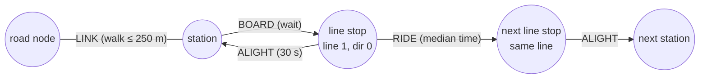

# Travel time engine

Code: `crates/engine/src/lib.rs` (Rust, WebAssembly) and `web/src/engine/*.ts` (graph building, snapping, paths).

## Graph model

The network is one graph made of road nodes plus, when `transit.bin` is loaded, transit nodes appended after them.



| Edge kind (`network.ts`) | From → to | Cost |
|---|---|---|
| `EDGE_ROAD` | road node ↔ road node | Length / speed, depends on the mode and on BD TOPO flags |
| `EDGE_LINK` | station ↔ 3 nearest walkable road nodes | Walking time (min 20 m) |
| `EDGE_BOARD` | station → line stop | Wait: half the headway (capped at 12 min) + 60 s boarding penalty |
| `EDGE_RIDE` | line stop → next line stop | Median scheduled ride time |
| `EDGE_ALIGHT` | line stop → station | 30 s |

A *line stop* is one (line, direction, station). Splitting the station from the line stops is what makes
transfers cost a new wait: staying on the same line follows `RIDE` arcs only, changing line goes through
`ALIGHT` → station → `BOARD`.

## Costs per mode (`profile.ts`)

| Mode | Roads | Transit edges |
|---|---|---|
| `pedestrian` | 4 km/h both ways (same as the GPF route service), ×2 on stairs; motorways and ramps excluded | ignored |
| `bike` | 15 km/h, ×1.1 on cycle lanes and greenways, ×0.65 on unpaved paths; one-way streets respected except contraflow cycle lanes | ignored |
| `car` | BD TOPO average speed × traffic factor of the hour + 3 s per section, one-way streets respected | ignored |
| `transit` | as pedestrian | all, bus edges only if the bus toggle is on; wait and ride time of the chosen hour |

The **hour of departure** (`ProfileOptions.hour`, 0–23) drives two things:

- car: `TRAFFIC` in `profile.ts` keeps a share of the free-flow speed per hour, one curve for major roads (BD TOPO
  importance 1–3) and one for local streets (e.g. 42 % / 60 % at 8 am). A typical congestion curve, not live traffic;
- transit: each boarding and ride reads its value for that hour from `hourCosts`; a line with no departure that hour
  has an infinite wait, so it is not used.

Each edge gets two costs, `fwd` (A→B) and `bwd` (B→A), `Infinity` when forbidden. The engine only sees arcs, so
`buildProfile` turns them into a compressed sparse row graph (CSR):

```
offsets[n] .. offsets[n+1]   arcs leaving node n
heads[arc]                   arrival node
costs[arc]                   seconds
arcEdge[arc]                 source edge, to rebuild the path and its geometry
```

For an **arrival**, every arc is reversed while building the CSR: one Dijkstra from the point then gives, for each
node, the time to reach the point.

## Dijkstra in WebAssembly

`crates/engine` exposes raw C functions, without `wasm-bindgen`:

| Export | Role |
|---|---|
| `reserve(nodes, arcs, sources)` | Allocates every buffer (once per profile) |
| `offsets_ptr()`, `heads_ptr()`, … | Pointer of each buffer in the WASM memory; JS writes the graph there |
| `run(sources, max_cost)` | Bounded multi-source Dijkstra, returns the number of settled nodes |
| `dist_ptr()`, `pred_node_ptr()`, `pred_edge_ptr()` | Results, read by JS as typed array views |

Implementation details that matter for speed:

- **Bounded**: a node is never pushed beyond `max_cost` (the scale, e.g. 30 min). The search stops by itself.
- **Lazy reset**: `touched` lists the nodes reached last time; only those are reset to `Infinity` before the next
  run, instead of the whole array (~100 k road nodes, ~30 k more with transit).
- **Heap key** `(f32 bits, node)`: non-negative floats order like their bit patterns, so a `u32` comparison is
  enough.
- **No allocation** in `run`: the heap and `touched` keep their capacity.
- After `reserve`, JS recreates its views on `memory.buffer`, because growing the memory detaches old views.

Typical run: ~1 ms walking, up to ~6 ms in transit with a 60 min scale.

## From the cursor to the graph (`snap.ts`)

The cursor can be anywhere (a park, a roof). `SnapIndex` is a uniform grid (80 m cells) of the road segments the
mode can use. `nearest(x, y)` scans rings of cells around the cursor and projects the point on each segment. It
returns the edge, the fraction `f` along it, the distance and the projected point. Beyond 600 m, the cursor is off
the network.

`TravelEngine.run` then seeds Dijkstra with **two sources**, the two ends of the snapped edge:

```
cost(A) = access walk + f × cost of the edge towards A
cost(B) = access walk + (1 − f) × cost of the edge towards B
```

The access walk (cursor → street) is always at walking speed, including in car mode.

## Pinned point: time and path to the cursor

With a pinned origin, `timeAt` snaps the cursor and takes the best of its two edge ends (`dist[A] + f × …`,
`dist[B] + (1 − f) × …`), plus the walk to the cursor. No new Dijkstra.

`path` walks back `predNode` / `predEdge` from that node, and `legs.ts` groups the edges into the trip panel legs:
consecutive streets of the same name, one wait per boarding, one ride per line (from the first to the last stop).

## Statistics

- `stationShare`: share of the metro, RER, train and tram stations (`railStations`) reached within each contour.
- `reachedKm`: kilometres of road whose two ends are reached within each contour.
- `areaKm2`: area of the 200 m cells holding a reached node.
- `reachedTransit`, `nearestStation`: stations and lines one can board, first rail station reached.
- `cyclewayKm`: kilometres of cycle lanes and greenways reached.

## Coordinates

Everything is stored in Web Mercator metres **relative to the centre of the zone** (`origin` in `graph.bin`). With
absolute Mercator values (~260 000 m, ~6 250 000 m) a 32 bit float has a step of about 0.5 m; relative to the centre,
it stays under a millimetre. Ground distances use the scale factor `cos(latitude)` of the zone centre.
